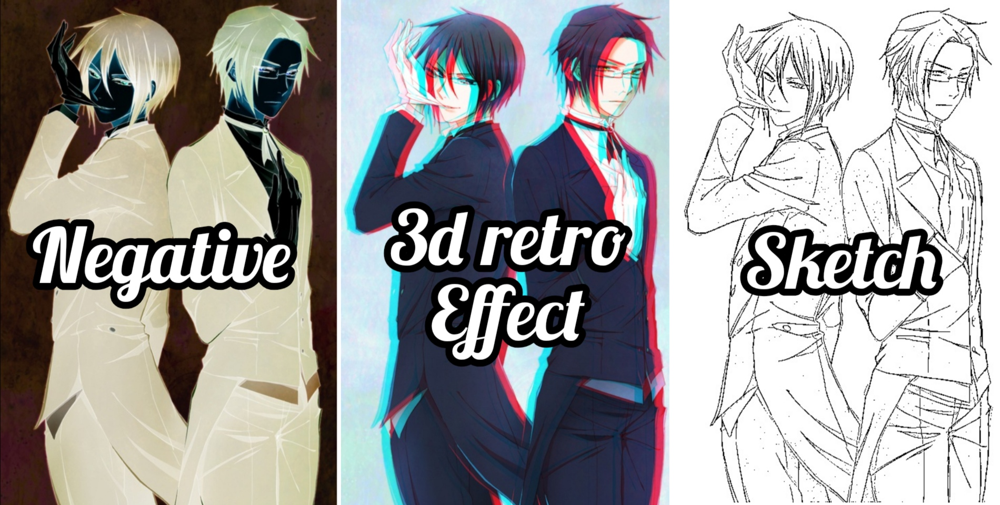

**Python Version : 3.7.4**

## Image Effects 

Effects for different images including the negative effect , the 3D retro effect , technically
know as anagylph and the sketch effect can be achieved through my code currently . 

These effects are similar to those of photo booth , snapchat filters and others . All I have 
done is tried to achieve a few of them through my code , written in pure python using OpenCV library 
and various others . 


## Getting Started

These instructions will get you a copy of the project up and running on your local machine for development and testing purposes. 

### Prerequisites

The libraries used for carrying out the effects in the project include : 

1. Opencv-Python 
2. Argparse 
3. Pillow 
4. os 
5. Numpy 
6. tqdm 

The installation of the required packages on your local machine , done after cloning the 
project , can be proceeded by writing the following command . 
```
pip install -r requirements.txt
```

### Installing

A step by step series to help you get the code running on your local machine .

**Clone the repository through your command line in C:/Users/YourName folder.**

```
git clone 'https://github.com/AemieJ/Effects.git'
```

**Install all the required libraries for this project by the command used in Prerequisites.**

```
pip install -r requirements.txt
```

Your images should be stored in the Image folder , you can also try out the sample images for fun sake . 

**First , you have to operate the dirs.py from your command line or terminal as follows .**

```
python dirs.py
```
This will create an Effects folder which will store all the filtered images . 

**Run the following command for getting started .**

```
python effects.py -h
```
This will result in the required parameters for the user to input to get the filter/effect 
working on the image . 

```
>>> Filters available 
>>> n for negative image
>>> s for sketch of the image 
>>> a for 3D retro effect

optional arguments: 
  -h,--help  shows this help message and exit 
  -f F       enter fileName of your picture 
  -filter FILTER [FILTER ...]  Filter(s) you want to apply to your image
```

After you have received the message as above , you are ready to run your code . In the filter
argument , you can pass either a single or multiple filters separated by a space . 

Example , if you want to pass perform a single effect on your image , you can write the command as follows : 

```
python effects.py -f fileName -filter s 
```
The above code will generate a sketch for the fileName image . 

For running multiple effects on your image at once , write the following command

```
python effects.py -f fileName -filter s n a 
```
It will perform all the 3 effects on your image one by one and store 
it in their respective folders.

## Running the tests

For the sketch effect of the image , you can control the thickness of the lines and number of details you want 
to observe in your sketch . 

These can be done by moving into the sketch.py file and making changes to the line 17
```
thresh = cv2.adaptiveThreshold(img_blend, 255, cv2.ADAPTIVE_THRESH_GAUSSIAN_C, cv2.THRESH_BINARY, 9,13)
```
The last 2 parameters are responsible for thickness of the lines and details to observe in the sketch effect . 
These 2 values can continuously be adjusted and played around with to get the sketch effect of the image as per your 
requirement . 

## Demo on the black butler anime with the effects 



## Built With

* [OpenCV-python](https://docs.opencv.org/master/) - Library aimed at real-time Computer Vision
* [Numpy](https://docs.scipy.org/doc/numpy/reference/) - Library for adding support for large multidimensional arrays and matrices
* [Pillow](https://pillow.readthedocs.io/en/stable/) - Library that adds support for opening, manipulating, and saving many different image file formats 

## Authors

* **Aemie Jariwala** - *Initial work* - [AemieJ](https://github.com/AemieJ)

